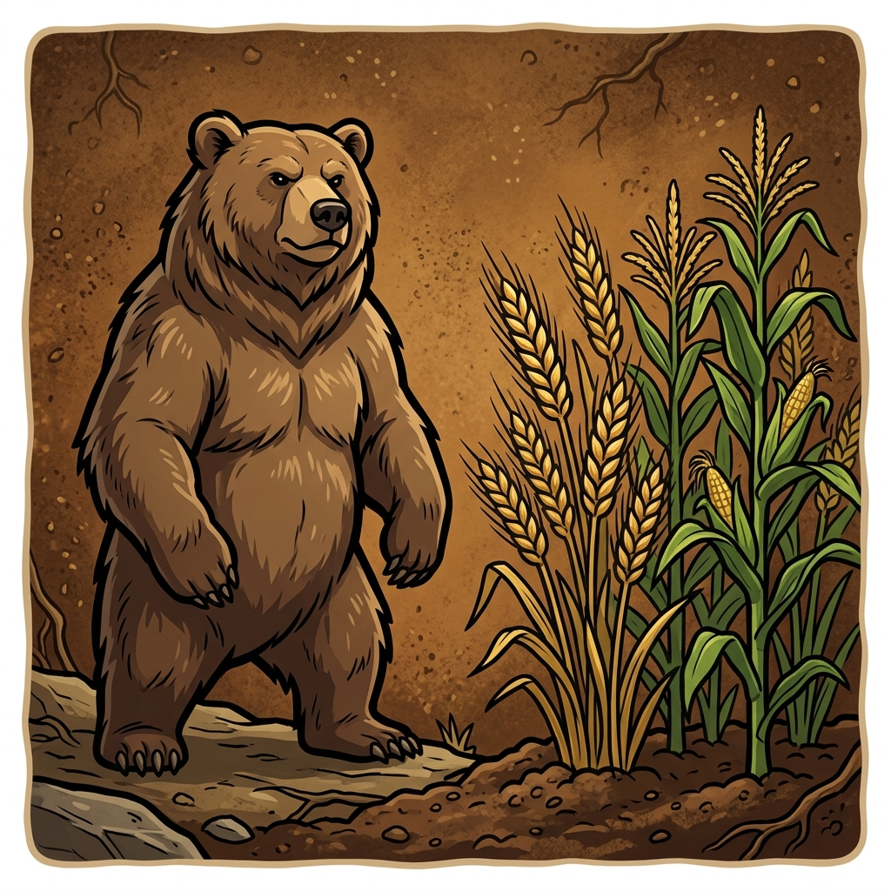

# Grounded: Realistic Stats Overhaul

Pure XML + minimal DLL (50 lines, no Harmony). Real biology and physics in RimWorld — without breaking gameplay.

## Features

### 🐾 Animals (49 species)
Realistic stats from zoological data: body size, speed, lifespan, gestation, litter size, diet, hunger rate, temperature tolerance, manhunter chance. Meat and leather proportional to body size (bodySize×100 / ×40).

### 🌳 Trees (14 species)
Growth time and yield scaled from real timber maturation age. Sqrt-scaled to keep gameplay viable.

| Tree | IRL years | growDays | harvestYield | Walls |
|------|-----------|----------|-------------|-------|
| Bamboo | 3-5 | 11 | 10 | 2 |
| Cocoa | 3-5 | 11 | 20 (chocolate) | — |
| Cecropia | 5-8 | 13 | 20 | 4 |
| Poplar | 10-15 | 18 | 27 | 5 |
| Willow | 8-15 | 18 | 27 | 5 |
| Drago | 10-20 | 20 | 30 | 6 |
| Palm | 15-25 | 23 | 16 | 3 |
| Saguaro | 10-30 | 23 | 8 | 1 |
| Birch | 20-30 | 25 | 39 | 7 |
| Pine | 25-35 | 27 | 43 | 8 |
| Maple | 30-50 | 31 | 50 | 10 |
| Teak | 40-60 | 35 | 56 | 11 |
| Cypress | 40-70 | 36 | 59 | 11 |
| Oak | 60-80 | 41 | 67 | 13 |

### 🌾 Crops

| Crop | Changes | Why |
|------|---------|-----|
| 🥔 Potato | Yield 14, rot 14d, mass 0.1kg, temp 2°C | Yield king, but spoils fast and heavy |
| 🍚 Rice | Mass 0.02kg, temp 12°C | Tropical grain, light but needs warmth |
| 🌽 Corn | Temp 10°C | Warm-season crop |
| 🍓 Strawberry | Rot 7d, price 1.5, temp 5°C | Luxury that spoils quickly |

### ⚖️ Realistic Mass

| Category | Change | Effect |
|----------|--------|--------|
| Stone blocks | ×2-3 heavier (2.3-3.5 kg) | Caravans with stone noticeably slower |
| Mortar shells | ×2-2.8 heavier (2.5-3.5 kg) | Artillery logistics matter |
| Wood | 0.4 → 0.7 kg | Building material has weight |
| Steel | 0.5 → 0.8 kg | Metal ingots feel real |
| Uranium | 1.0 → 2.0 kg | Dense material is dense |
| Meals | Simple 0.4, Fine 0.5 kg | Heavier food = fewer stacks carried |
| Pemmican/Kibble | 0.04 kg | Travel rations have weight |

### 📦 Smart Stack Limits (DLL)
Auto-calculated at game load: `stackLimit = 30kg / item mass`, capped at 500. Light items stack more (rice 500), heavy stay vanilla (steel 75). Works for ALL stackable items including modded. Only exception: medicine.

### 🔊 Animal Sounds
Custom sounds for: Fox, Jaguar, Leopard, Ostrich, Puma, Tiger, Turkey, Wolf

## Compatibility

| Mod | Status |
|-----|--------|
| Combat Extended | ✅ Full support (body types, armor) |
| Vanilla Animals Expanded | ✅ All packs |
| Alpha Animals | ✅ |
| DLC: Biotech | ✅ |
| DLC: Odyssey | ✅ |

## Installation

1. Download or clone this repository
2. Copy to your RimWorld `Mods/` folder
3. Enable in mod list
4. Requires: nothing (no Harmony, no dependencies)

## Design Philosophy

- **Pure XML where possible** — DLL only for stack calculation (50 lines)
- **Every buff has a nerf** — more potato yield = faster rot; lighter rice = needs warmth
- **No behavior changes** — animals act vanilla, just with real numbers
- **Compatible with everything** — no Harmony, no method patches, no conflicts

## Credits

Animal stats from zoological literature. Tree growth from forestry data. Crop balance from agricultural science. Mass values from real-world measurements.

## License

Free to use, modify, and redistribute.

Portions of the materials used to create this content/mod are trademarks and/or copyrighted works of Ludeon Studios Inc. This content/mod is not official and is not endorsed by Ludeon.
